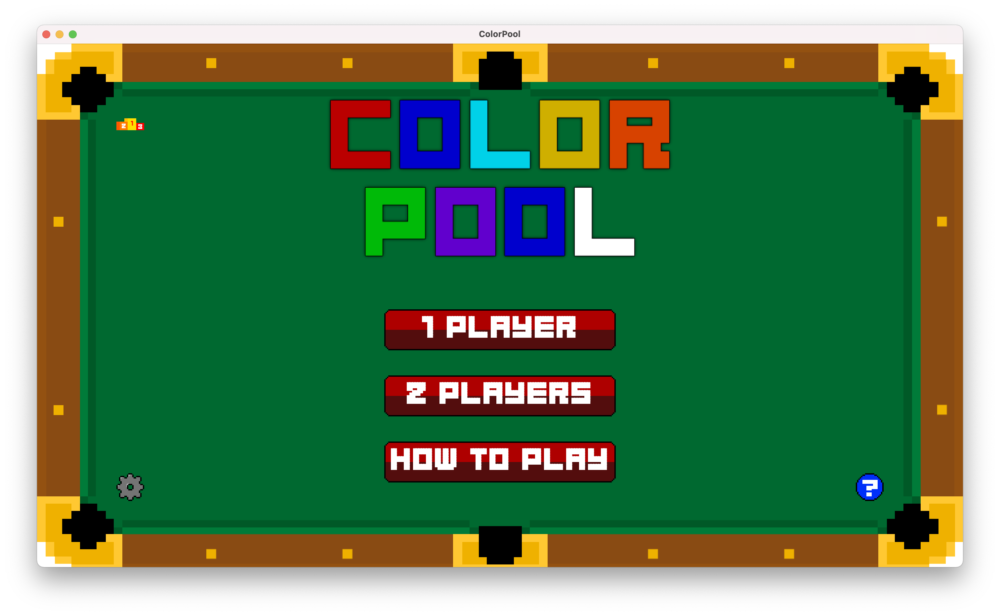
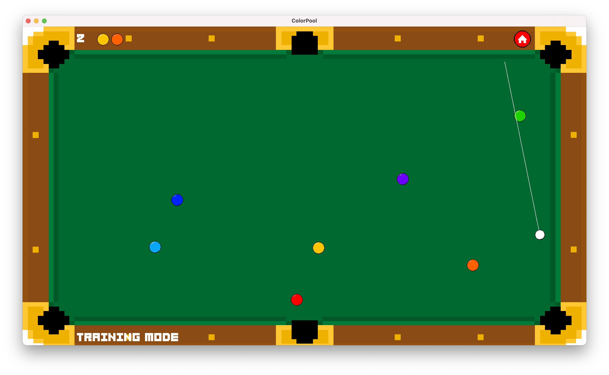
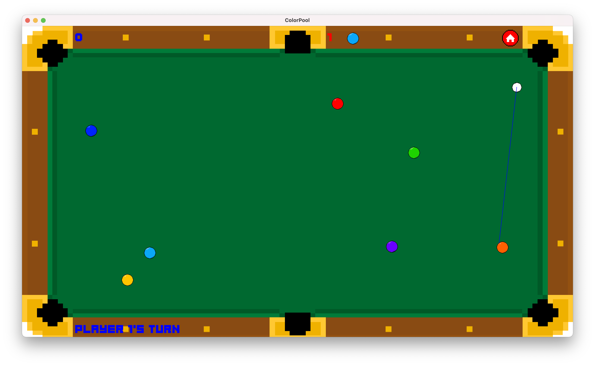

# ColorPool
Pool game developed using Java and Java Swing for GUI programming course, at Università della Calabria, AA 2019/2020.

The purpose of this project was to prove the acquired competences about GUI and event-based programming in Java and Java Swing.

There are two gamemodes:
- *Single player*, or where a player can train;
- *Multiplayer*, where two players can compete against each other.

---

